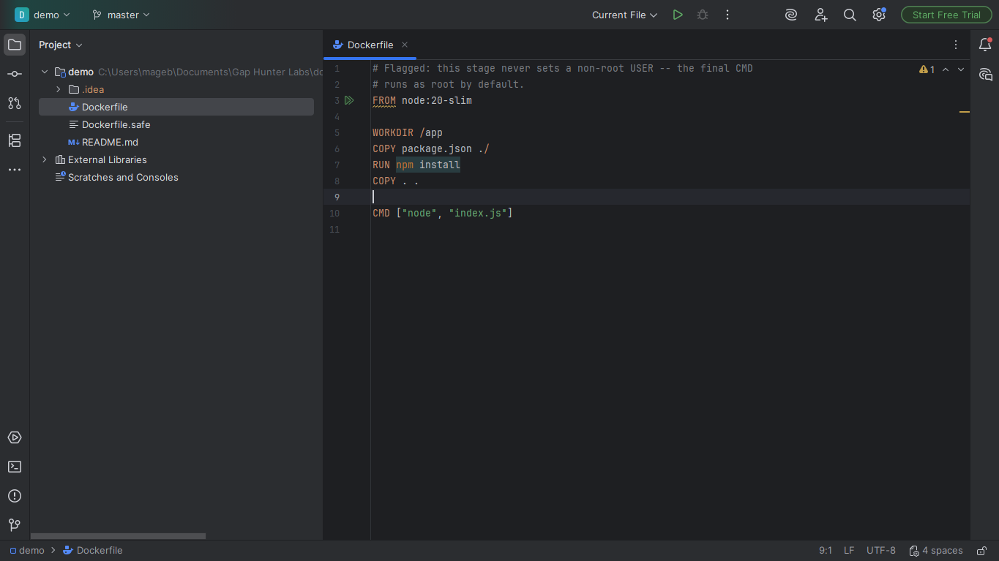
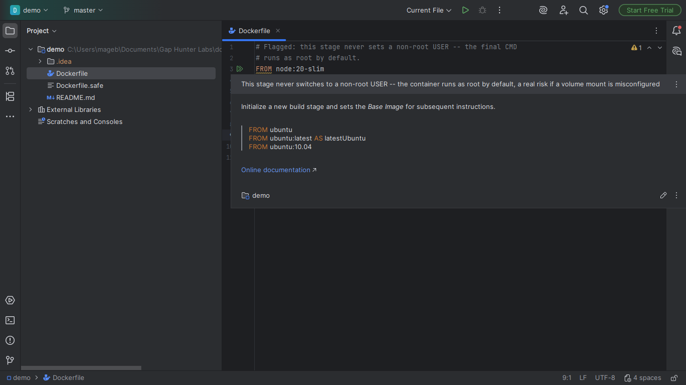
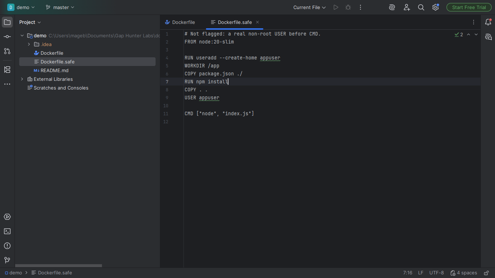

# Dockerfile Missing USER Instruction Companion

Warning when a Dockerfile's FINAL build stage never sets a non-root
`USER` -- Docker runs a container as root by default when `USER` is
absent.

## Screenshots







## Why it exists

A real risk documented explicitly by Docker's own guide for the
instruction: container escape/privilege escalation if a volume mount
is misconfigured. Confirmed with the strongest evidence available: an
open issue in hadolint's own repository (`hadolint/hadolint#1089`,
still open as of 2026-09) asking for exactly this rule -- not even the
standard Dockerfile CLI linter has it implemented yet.

## Why built this way

- **Reasons over real multi-stage structure** -- a `USER` instruction
  in an EARLIER stage never counts on its own; only the file's last
  `FROM` (the stage a plain `docker build` with no `--target` actually
  runs) is checked.
- **Follows stage inheritance (since 0.2.0)** -- when that final stage
  builds on a PREVIOUS named stage from the same file
  (`FROM base AS final`, not an external image), Docker inherits that
  stage's state, `USER` included. The check follows the same chain, so
  a shared `base` stage that already switched to a non-root user isn't
  re-flagged just because later stages don't repeat the instruction.
- The LAST `USER` instruction found in the (possibly inherited) final
  stage decides -- a stage that switches back to `USER root`/`USER 0`
  after an earlier non-root `USER` is still flagged, since that's the
  real effective user at container start.
- 100% static text analysis -- a plain-text line scanner, not a real
  Dockerfile parser, so it works whether the real Docker/Dockerfile
  plugin is installed or not.

## v0.2 scope — stated honestly, not exhaustively

- Never validates that the referenced user actually exists (`USER
  appuser` with no prior `RUN useradd appuser` is a different problem,
  out of scope here).
- A `USER` instruction split across lines with a trailing `\` is not
  recognized -- rare in practice since the instruction is short, but a
  known gap.
- Doesn't know what user a base image itself defaults to (some public
  images already switch off root); only tracks `USER` instructions
  actually written in the scanned file(s).

## Usage

Open any `Dockerfile`/`*.dockerfile`/`Dockerfile.*` file. A final stage
with no real non-root `USER` shows a warning on its `FROM` line.

## Enterprise / Team Licensing

Need enterprise features, custom rules, or team licensing? Contact us at
**gaphunterlabs@gmail.com**.

## Development

```
./gradlew test           # unit tests
./gradlew buildPlugin    # generates build/distributions/*.zip
./gradlew verifyPlugin   # checks compatibility against real IDEs
```

## License

Apache-2.0. See `LICENSE`.
